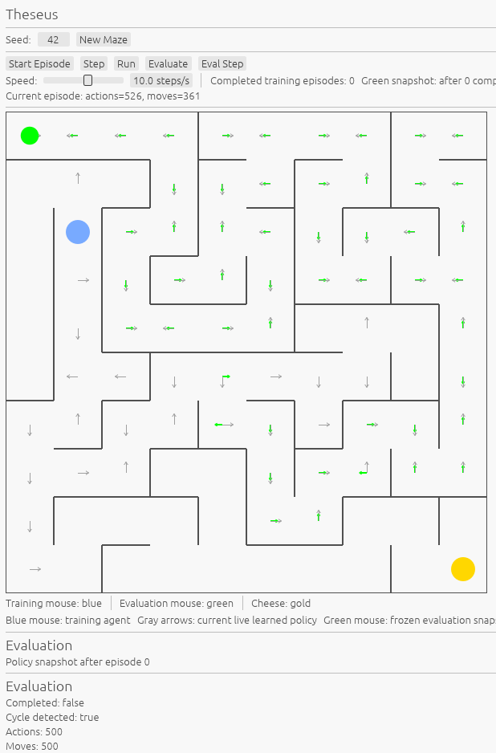

# Theseus

[](https://github.com/gbacon/theseus-rs/actions/workflows/test.yml)
[](https://github.com/gbacon/theseus-rs/actions/workflows/pages.yml)

Theseus is a browser-based reinforcement-learning experiment inspired by Claude Shannon's maze-solving mouse.

The project is written in Rust and compiled to WebAssembly. A mouse learns to navigate a randomly generated perfect maze using tabular Q-learning while the interface visualizes both the actively learning agent and a frozen snapshot of its current policy.

## Live Demo

[Run Theseus in your browser](https://gbacon.github.io/theseus-rs/)



## What You Are Watching

The visualization contains two mice.

- **Blue mouse** — the training agent. It uses an epsilon-greedy policy, explores the maze, and updates its Q-table after each action.
- **Green mouse** — a frozen evaluation snapshot taken at the beginning of the current training episode. It does not learn while it runs, so it shows what the agent knew before that episode began.

The arrows visualize learned policy:

- **Gray arrows** show the current live training policy.
- **Green arrows** show the frozen evaluation policy.

The gold marker represents the cheese.

Early in training, the green mouse may make poor choices, become trapped in cycles, or fail to reach the cheese. As learning progresses, the policy becomes more reliable and eventually converges on a direct route through the maze.

## Learning Algorithm

Theseus currently uses tabular Q-learning.

For a transition from state $s$, taking action $a$, receiving reward $r$, and arriving at state $s'$, the update is

$$
Q(s,a) \leftarrow Q(s,a) +
\alpha
\left[
r + \gamma \max_{a'} Q(s',a') - Q(s,a)
\right].
$$

The agent uses an epsilon-greedy action-selection policy:

- with probability $\epsilon$, choose a random action;
- otherwise, choose an action with the highest known Q-value.

The current demonstration uses approximately:

```text
epsilon = 0.20
alpha   = 0.50
gamma   = 0.99
```

The environment rewards reaching the cheese and penalizes inefficient or invalid behavior.

## Maze Generation

Each maze is a perfect maze generated using randomized depth-first search.

A perfect maze:

- connects every cell;
- contains no loops;
- has exactly one simple path between any two cells.

This gives the learner a well-defined navigation problem while still producing a different topology for different random seeds.

## Architecture

The implementation is split into small Rust modules:

```text
src/
├── agent.rs
├── app.rs
├── environment.rs
├── episode.rs
├── lib.rs
├── main.rs
├── maze.rs
├── mouse.rs
├── q_learning.rs
└── runner.rs
```

The main responsibilities are:

- `maze.rs` — maze representation, generation, movement rules, and shortest-path calculation
- `environment.rs` — rewards and environment transitions
- `mouse.rs` — mouse state
- `episode.rs` — state and accounting for one run through the maze
- `agent.rs` — agent abstraction and random agent
- `q_learning.rs` — Q-table and Q-learning agent
- `runner.rs` — training and evaluation loops
- `app.rs` — interactive visualization
- `lib.rs` / `main.rs` — native and WebAssembly entry points

## Technology

Theseus is built with:

- [Rust](https://www.rust-lang.org/)
- [eframe / egui](https://github.com/emilk/egui)
- [WebAssembly](https://webassembly.org/)
- [Trunk](https://trunk-rs.github.io/trunk/)

The same Rust application architecture supports both native execution and browser deployment.

## Build and Run

### Prerequisites

Install Rust and the WebAssembly target:

```bash
rustup target add wasm32-unknown-unknown
```

Install Trunk:

```bash
cargo install trunk
```

or, if you use `cargo-binstall`:

```bash
cargo binstall trunk
```

### Run in the Browser

```bash
trunk serve
```

Then open the URL reported by Trunk.

For a GitHub Codespace:

```bash
trunk serve --address 0.0.0.0 --port 8080
```

and open the forwarded port.

### Native Build

```bash
cargo run
```

## Tests

Run the Rust test suite with:

```bash
cargo test
```

## Production Build

For deployment as the `theseus-rs` GitHub Pages project:

```bash
trunk build --release --public-url /theseus-rs/
```

The generated site is written to `dist/`.

## Why Theseus?

Claude Shannon built an electromechanical maze-solving mouse named Theseus in the early 1950s. His machine could explore a maze and remember a route to the goal.

This project is not intended as a faithful simulation of Shannon's hardware. Instead, it asks a related question:

> What might a small, transparent maze-learning experiment inspired by Theseus look like using modern Rust and reinforcement learning?

The emphasis is therefore on visibility and experimentation. The learner is deliberately simple enough that its behavior can be inspected rather than hidden behind a large model or framework.

## Project Page

Additional background on the original Theseus project is available at:

[blog.gbacon.com/projects/theseus-mouse](https://blog.gbacon.com/projects/theseus-mouse)

## License

This project is licensed under the [MIT License](LICENSE).